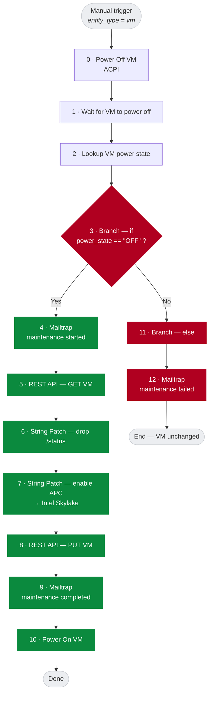

# Playbook: Advanced Processor Compatibility (APC) maintenance window

Manual X-Play playbook that changes a VM's CPU compatibility baseline (Advanced
Processor Compatibility / APC) inside a maintenance window, with email
notifications before and after, and an if/else that only proceeds once the VM is
confirmed **powered off**.

- **File:** [`playbook.json`](playbook.json)
- **Trigger:** Manual (`entity_type = vm`) — runs **once per selected VM**. Select
  several VMs at run time to batch them (you can filter the selection by a
  *category* in the Prism Central run dialog, but the playbook itself does not use
  categories).
- **Prism Central API used:** v3 VM read/update (`/api/nutanix/v3/vms`) and the
  VMM v4 CPU model reference (`cpuModel.extId`).
- **Notifications:** Mailtrap Email API (`https://send.api.mailtrap.io/api/send`).

---

## Flow



If the VM cannot be powered off, execution jumps to the **else** branch (11 → 12)
and the CPU change is skipped.

---

## Prerequisites

1. **Prism Central 7.x** with **X-Play** enabled and API access (`admin` or a
   user that can manage action rules and VMs).
2. A **Mailtrap account** and an **API token** with sending access.
3. The **CPU model UUID** you want to pin (see the next section).

---

## Values to replace

The committed `playbook.json` contains placeholders. Replace them with your own
values (before import, or edit the playbook in Prism Central afterwards):

| Placeholder | Where | Replace with |
|---|---|---|
| `<PRISM_HOST>` | "REST API — GET/PUT" action URLs | Your Prism Central FQDN or IP |
| `<PC_PASSWORD>` | "REST API — GET/PUT" actions (basic auth) | Prism Central password for your API user |
| `<MAILTRAP_API_TOKEN>` | The three Mailtrap actions (`token`, bearer auth) | Your Mailtrap API token |
| `<FROM@YOUR-VERIFIED-DOMAIN>` | Mailtrap actions `from.email` | A sender on a **verified** Mailtrap sending domain (or Mailtrap's demo domain `hello@demomailtrap.co` for a quick test) |
| `<RECIPIENT@EXAMPLE.COM>` | Mailtrap actions `to[0].email` | Who receives the notifications |
| `admin` | "REST API" actions `username` | Your Prism Central API user (default `admin`) |

Also review:

- **CPU model** (`cpu_model_reference.uuid` / `name`) in the "String Patch — enable APC" action.
- **Wait duration** (`wait_duration`, default `45` seconds) in the "Wait" action.
- **Maintenance window** text in the email bodies.

Secrets are **not** stored in this repo. In Prism Central the Mailtrap token and
the PC password live in the action's secret fields (masked as `********` when
read back).

---

## How to get the CPU model UUID (e.g. Intel Skylake)

APC pins a VM to a **CPU compatibility baseline**, identified by a fixed,
globally-unique `extId`/UUID. Nutanix does **not** expose an API to list these
CPU models (endpoints like `/api/vmm/v4.x/ahv/config/cpu-models` return `404`),
and a **name alone is rejected** ("CPU Model Name" invalid). You must supply the
UUID. To discover it:

1. In Prism Central, open a test VM → **Update** → set **CPU Model** to the
   baseline you want (e.g. *Intel Skylake*) → Save. (Leave APC enabled.)
2. Read the VM back and copy the `cpuModel.extId`:

   **VMM v4 (recommended):**
   ```bash
   VM=<vm-extId>
   curl -k -u admin:CHANGEME \
     "https://<PRISM_HOST>:9440/api/vmm/v4.1/ahv/config/vms/$VM" \
     | jq '.data.apcConfig.cpuModel'
   # -> { "extId": "315e63e4-d549-5a45-affd-c766032de984", "name": "Intel Skylake" }
   ```

   **v3:**
   ```bash
   curl -k -u admin:CHANGEME \
     "https://<PRISM_HOST>:9440/api/nutanix/v3/vms/$VM" \
     | jq '.spec.resources.apc_config.cpu_model_reference'
   ```

The UUID is stable across clusters, so the values below can be reused directly:

| CPU baseline | UUID |
|---|---|
| Intel Broadwell | `a2e1a75b-988c-50aa-88f3-b68e54d58958` |
| Intel Skylake | `315e63e4-d549-5a45-affd-c766032de984` |

Put the pair into the "String Patch — enable APC" action:

```json
{ "enabled": true,
  "cpu_model_reference": { "kind": "cpu_model",
                           "uuid": "<CPU_MODEL_UUID>",
                           "name": "<CPU_MODEL_NAME>" } }
```

---

## Import

```bash
PC=<prism-central-host>
curl -k -u admin:CHANGEME \
  -H 'Content-Type: application/json' \
  -X POST "https://$PC:9440/api/nutanix/v3/action_rules" \
  --data @playbook.json
```

Then, in Prism Central → **Operations → Playbooks**, open
*Enable APC (change processor) on VMs*, review/edit it, and enable it.

**Run it:** select the VM(s) and click **Run**. The playbook executes once per VM.

---

## Technical notes / gotchas

- **v3 VM update is a full-spec replace.** You must send the VM object back with
  its `spec` (and `metadata`/`api_version`), but the read-only top-level
  `status` key must be removed first (step 6) or the API returns
  `422 Additional properties are not allowed ('status')`.
- **String Patch uses JSON Pointer paths**, not JSONPath. Remove `status` with
  `/status` (not `$.status`); set the baseline at
  `/spec/resources/apc_config`.
- **Action outputs** are referenced as `{{action[N].<output>}}`, where `N` is the
  **0-based index of the action in the `action_list`**. The Branch condition must
  only reference actions earlier in its branch chain.
- **`cpuModel.name` alone is rejected** — always pass `extId`.
- **Power-off is ACPI + a fixed wait.** If the guest lacks tools or ignores ACPI,
  increase the wait or switch the mechanism to `hard`. The branch (step 3) makes
  the "not off" path explicit and safe.
- **Check delivery:** https://mailtrap.io/sending/email_logs
